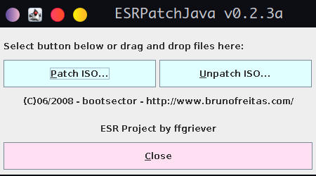

### ESRPatchJava

  

I don't know who is author(s), check code, maybe you'll find out. 'ffgriever' and 'bootsector' maybe?

History of changes you can track on git logs. Updated for using with Java 8+, added CI, Maven etc.

Taken from https://sksapps.haldrie.com/ps2exploit.php
